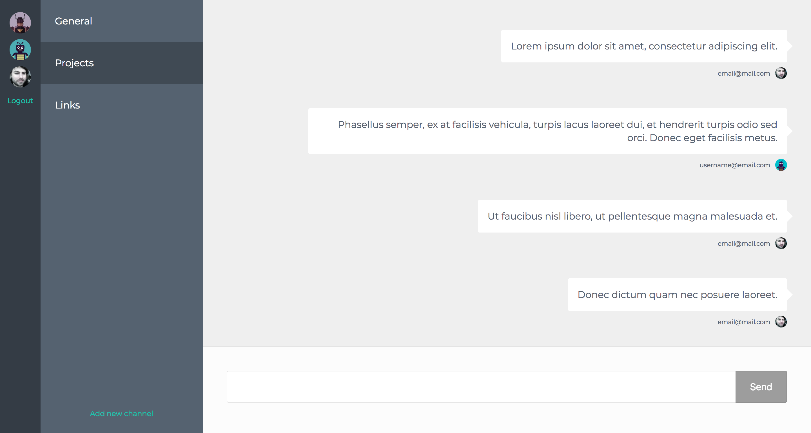

# Ex Hyper Feathers

A basic (example) realtime chat app that allows users to signup, create chat rooms and start chatting.

The backend (server) is a `feathersjs` application.
The frontend (client) is a `hyperapp` app utilizing parceljs.

Because this is just an simple example application, for convienience both the server and client are included in this repo.

## Running:
```bash
# Backend
cd server
yarn install
yarn start

# Frontend
cd client
yarn install
yarn start
```

